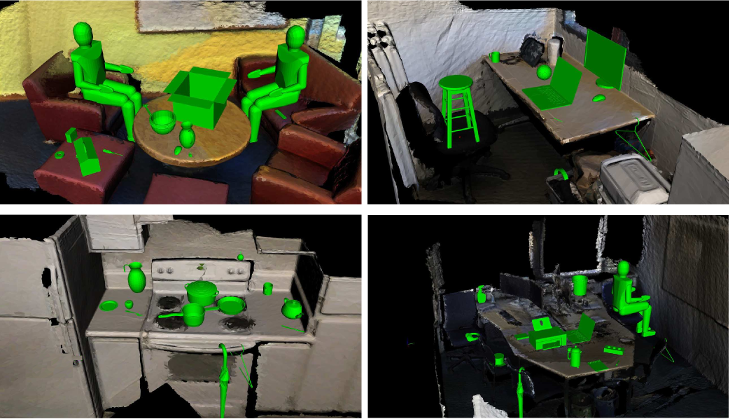

## What can I do here? Leveraging Deep 3D saliency and geometry for fast and scalable multiple affordance detection


This paper develops and evaluates a novel method that allows for the detection of affordances in a scalable and multiple-instance manner on visually recovered pointclouds. Our approach has many advantages over alternative methods, as it is based on highly parallelizable, one-shot learning that is fast in commodity hardware. The approach is hybrid in that it uses a geometric representation together with a state-of-the-art deep learning method capable of identifying 3D scene saliency. The geometric component allows for a compact and efficient representation, boosting the performance of the deep network architecture which proved insufficient on its own. Moreover, our approach allows not only to predict whether an input scene affords or not the interactions, but also the pose of the objects that allow these interactions to take place. Our predictions align well with crowd-sourced human judgment as they are preferred with 87% probability, show high rates of improvement with almost four times (4x) better performance over a deep learning-only baseline and are seven times (7x) faster than previous art.

You can find the paper [here](https://arxiv.org/abs/1703.10584).

### Citation 
If you find our work useful in your research, please consider citing:

    @article{ruiz2018deep,
    title={What can I do here? Leveraging Deep 3D saliency and geometry for fast and scalable multiple affordance detection},
    author={Ruiz, Eduardo and Mayol-Cuevas, Walterio},
    journal={arXiv preprint arXiv:2494113},

    year={2018},
    }

### Agglomerative descriptor
We provide code to build the agglomerative descriptor based on agglomeration and clustering of interaction tensors. The agglomeration and clustering code (i.e. *training*) can be found in:
```
agglo_clean.m
```
You need matlab to run it, but it should be easy to implement a python version.
This will look under the current directory for as many interactions tensors as possible, agglomerate them, perform clustering and save all the data for the agglomerative descriptor. You can (and should) assign an ID to identify the agglomerative descriptor. Look for the variable **d_number**. In the examples below we use 992.

In order to generate affordance examples you should read our instructions [here](https://github.com/eduard626/interaction-tensor#gui-for-training-examples) (GUI for training examples).
Essentially,  you need to *train* query-objects and affordances in order to generate their interaction tensors. 

### Multiple Affordance predictions

We provide c++ source code to test multiple affordances on any given location in a pointcloud. A script is provided in order to install the PCL version used to develop the code (1.8 trunk). This script assumes that the NVIDIA driver and CUDA are already installed in your PC. If you don't have these, I suggest you follow the instructions [here](https://docs.nvidia.com/cuda/cuda-installation-guide-linux/index.html "NVIDIA")

The script will create a directory inside the current path where some dependencies will be downloaded (qhull, VTK, PCL source, OPENNI, etc). Everything is set to be installed in the standard path **/usr/local/**.

Once you have installed the required libraries you can compile our code under **src/** with:

```
mkdir build && cd build
cmake ../src
make
```

That will create the shared libraries and code that you need. The main files you will need are:

1. multiTensorTest
2. myCuda
3. dev_array
4. meshSampling
5. convert_pcd_ascii_binary

The one named *multiTensorTest* is the one you need to make affordance location prediction. 

Essentially you need an agglomerative descriptor and an input scene; however, you can also query individual affordances since this codes is derived from our "Single affordance prediction" as is shown and explained [here](https://github.com/eduard626/interaction-tensor/blob/master/Testing/README.md).

In order to test the code for multiple affordances you should run:
```
./multiTensorTest centroids kitchen5.ply
```
Alternatively, if you only want to query a single affordance: 

```
./multiTensorTest Place bowl kitchen5.ply
```

The code will look for all the relevant files under the **data/** directory by default. These files comprised the *training* data, the input scene file and a text file with a few important parameters.

#### parameters.txt

This file controls important parameters and thresholds of the code. For this version of the code you only need to pay attention to the following lines:

3. Orienations: Number of orientations to test. It should be the same as training. Default: 8.
4. Sample: Percentage of points to test in the input scene
5. Debug: *Verbosity* of the output during run.
	* 0 -> No viewer, text only. Terminal shows progress of the run.
	* 1 -> Viewer showing scene and best-to-date affordance prediction
	* 2 -> Viewer showing scene and pausing at every good prediction. Terminal shows timings and extra info about pointclouds
6. Descriptor: Agglomerative descriptor ID. We provide an example with ID = 992, but you choose the ID based on your data.
	The code looks for data files with the base name: " New[descriptorID]_Approx_descriptor... " which are generated by the matlab *training* code.
9. PredictionT: Score threshold to consider a prediction as good. Default: 50 (ie. 50/100)


In principle you can change the location of the files by providing the scene file with its path. For instance:
```
./multiTensorTest centroids /home/user/Documents/kitchen5.ply
```

will use /home/user/Documents instead of the **data/** to look for all the files needed to run (relative paths are OK too). The only requirement is that you keep the following structure

```
+-- _data
|   +-- parameters.txt
|   +-- kitchen5.ply
|   +-- kitchen5_d.pcd
|   +-- agglo_clean.m
|   +-- tmp992.csv
|   +-- New992_Approx_descriptor[...].pcd
|   +-- ...
|	+--_Place
	|	+-- bowl.ply
	|	+-- ibs_full_Place_bowl.pcd
	|	+-- ibs_full_Place_bowl.txt
	|	+-- ...
|	+--_Fill
	|	+-- mug.ply
	|	+-- ibs_full_Fill_mug.pcd
	|	+-- ibs_full_Fill_mug.txt
	|	+-- ...
	.
	.
	.
```

**Important**: PCL GPU libraries need binary compressed pointclouds to work, so you need to convert your scene pointclouds to this encoding otherwise the code will crash, see below convert_pcd_ascii_binary for help.

The code will produce a few files with the data from the predictions and sampled points, the main file has the base name:

```
All_affordances_[scene]_3D_[orientations]_[predictionThreshold]_[descriptorID]_[timeStamp].pcd
```
or if you queried a single affordance
```
[affordance]_[query-object]_[scene]_3D_[orientations]_[predictionThreshold]_[descriptorID]_[timeStamp].pcd
```

Additionally, all important data follows the following convention:

The data files are:

* timeStamp_samplePoints.pcd: 3D coordinates of test-points sampled from the scene.
* timeStamp_goodPoints.pcd: 3D coordinates of good locations and encoded in RGB values the number of good predictions for each point.
* timeStamp_goodPointsX.pcd: Score, affordance_id and orientation_id of good predictions.

Notice that files share the same time stamp to make it easier to store and keep track of results/runs.

#### meshSampling

Our approach needs needs dense pointclouds, if you have CAD model of a scene that want to test (PLY/OBJ file) you can use *meshSampling* to sample points uniformly over the faces (triangulation)
of the CAD model. This is essentially the code you can find in the PCL examples with the voxelization disabled so you can set the number of points you want in your final pointlcloud. 

Syntax is:
``` 
./meshSampling input.{ply,obj} output.pcd <options>
```
where options are:
* -n_samples X =number of points in the final pointcloud (default 1000000)

#### convert_pcd_ascii_binary

PCL GPU-functions need binary compressed pointclouds. If you have a pointcloud (created with meshSampling or your own) you can use *convert_pcd_ascii_binary* to solve this issue.
Similarly to *meshSampling* this code is available in the PCL examples but we provide it for your convenience The syntax is as follows:
```
./convert_pcd_ascii_binary <file_in.pcd> <file_out.pcd> 0/1/2 (ascii/binary/binary_compressed) [precision (ASCII)
```

Here you would need to use 2 as the third parameter.